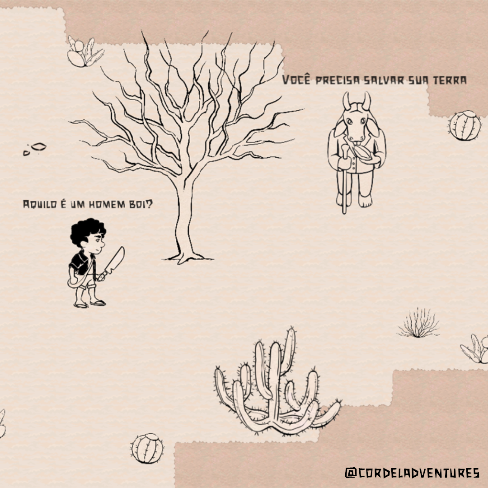
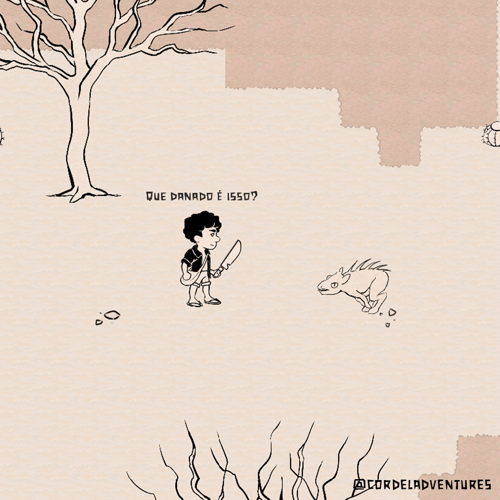
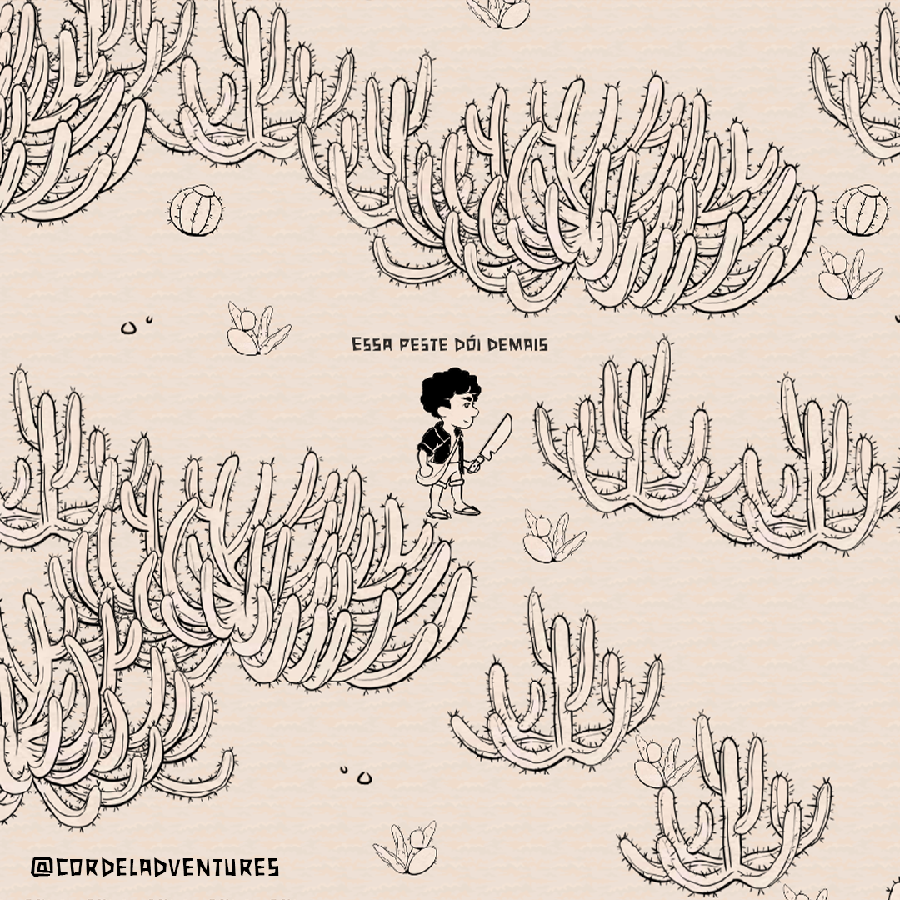
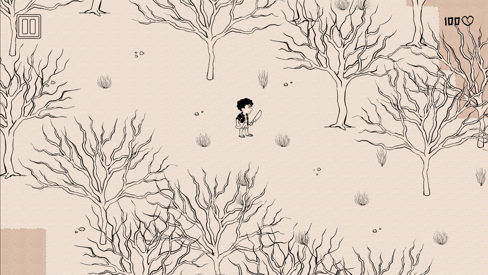

# CORDEL ADVENTURES
👨‍🏫JOGO TOPDOWN DE AVENTURA INSPIRADO NA CULTURA NORDESTINA.

   
   
   
   
   

## DESCRIÇÃO:
**Cordel Adventures** é um jogo de aventura topdown inspirado na cultura nordestina. O jogador assume o papel de um herói ou heroína que precisa salvar sua terra de um mal iminente. O jogo é dividido em fases, cada uma com seus próprios desafios e inimigos.

## IMPORTANDO PARA O GODOT ENGINE:
### MÉTODO 1: IMPORTAR VIA PACOTE DE RECURSOS (.tres/.res):
1. **Verificar o Código e Assets:**
   - Verifique se o repositório GitHub contém um arquivo `.tres` ou `.res`. Se sim, você pode importar diretamente para o Godot.
   - Se o repositório não possui esses arquivos, você precisará copiar o código e os assets manualmente.

2. **Importar o Pacote de Recursos:**
   - No Godot, vá para `Importar` > `Importar Pacote de Recursos`.
   - Navegue até o arquivo `.tres` ou `.res` que você baixou e selecione-o.
   - Clique em `Abrir` para adicionar o conteúdo ao seu projeto.

### MÉTODO 2: COPIAR E COLAR MANUALMENTE:
1. **Copiar o Código e Assets:**
   - Extraia o conteúdo do repositório GitHub (se ainda não o fez) em uma pasta no seu computador.
   - Navegue até a pasta do projeto Godot (normalmente localizada na raiz do diretório do projeto Godot).

2. **Adicionar o Conteúdo ao Projeto:**
   - Copie a pasta contendo o código e assets do repositório GitHub.
   - Cole a pasta na pasta do projeto Godot. O Godot reconhecerá e importará automaticamente os arquivos.

### CONFIGURAR O PROJETO NO GODOT:
1. **Abrir a Cena Principal:**
   - No painel `FileSystem`, vá para a pasta onde o código e assets foram importados. Procure por uma cena principal, normalmente chamada `Main.tscn`, `Game.tscn`, ou algo semelhante.
   - Clique duas vezes na cena para abri-la.

2. **Verificar e Ajustar Configurações:**
   - Certifique-se de que todos os scripts, nós (nodes) e outros assets foram importados corretamente.
   - Se houver scripts que precisam de referências, você pode precisar arrastar e soltar esses objetos no `Inspector` para configurar as referências corretamente.

3. **Adicionar Configurações Adicionais:**
   - Se o código exigir configurações específicas ou componentes adicionais, siga as instruções fornecidas no repositório GitHub. Verifique o README.md ou qualquer documentação que venha com o código.

## NÃO SABE?
- Entendemos que para manipular arquivos em muitas linguagens e tecnologias relacionadas, é necessário possuir conhecimento nessas áreas. Para auxiliar nesse aprendizado, oferecemos cursos gratuitos disponíveis:
* [CURSO DE GODOT](https://github.com/VILHALVA/CURSO-DE-GODOT)
* [VEJA A DOCUMENTAÇÃO DO GDSCRIPT](https://docs.godotengine.org/pt-br/4.x/tutorials/scripting/gdscript/index.html)
* [CONFIRA MAIS CURSOS](https://github.com/VILHALVA?tab=repositories&q=+topic:CURSO)

## CREDITOS:
- [PROJETO CRIADO PELO "romhenri"](https://github.com/romhenri/CordelAdventures)
- [PROJETO EDITADO PELO VILHALVA](https://github.com/VILHALVA)
